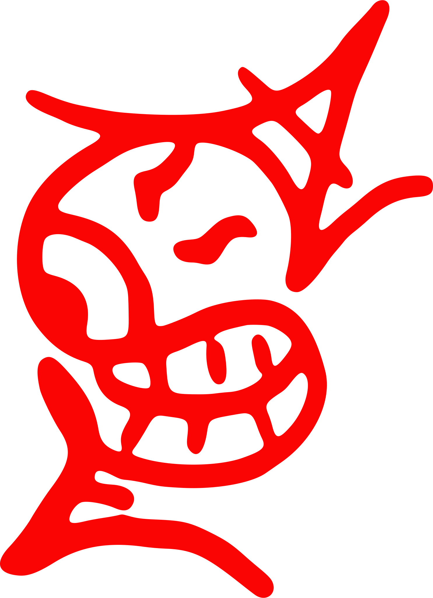

<!--  -->

#  About me

https://seanmorr.is/ | https://php-wasm.com/

https://www.npmjs.com/~seanmorris | https://packagist.org/packages/seanmorris/ | https://github.com/seanmorris

 

<table><tr>
  <td valign = "top" td align = "center">
    

    
    

    

  </td>
  <td valign = "top">
    
* I created [php-wasm](https://php-wasm.com/), which powers frontend php applications like [wordpress playground](https://wordpress.org/playground/).

* I'm working on a [Sonic Fangame](https://sonic-3000.seanmorr.is/) in my spare time.

<!-- * I started my first website in 1998, which started my addiction to the web. (It was for pokemon cheats) -->

* I've contributed code to the [Emscripten project](https://emscripten.org/docs/contributing/AUTHORS.html) (because of php-wasm).

* Besides running php on the frontend, I like doing weird stuff like running [LUA on SD cards](https://github.com/seanmorris/airmorris) and [parsing gameboy games with Javascript](http://github.com/seanmorris/pokemon-parser).
</td>
</td></table>

## Tools I use

---

### I am giving up my bed for one night.
> My Sleep Out helps youth facing homelessness find safe shelter and loving care at Covenant House. That care includes essential services like education, job training, medical care, mental health and substance use counseling, and legal aid — everything they need to build independent, sustainable futures.
>
> By supporting my Sleep Out, you are supporting the dreams of young people overcoming homelessness.
> 
> 
>
> Click here to help out: https://www.sleepout.org/participants/62915
>
> More info: https://www.sleepout.org/ | https://www.covenanthouse.org/ | https://www.charitynavigator.org/ein/132725416
> 
> Together, we are working towards a future where every young person has a safe place to sleep.
>
> Thank you.

---

  

  
*Coding is an art.*

  
