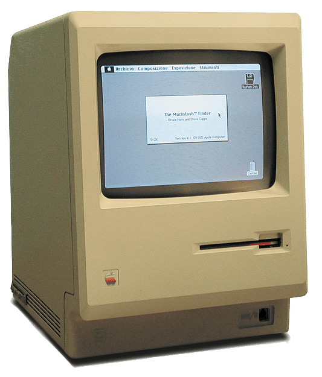
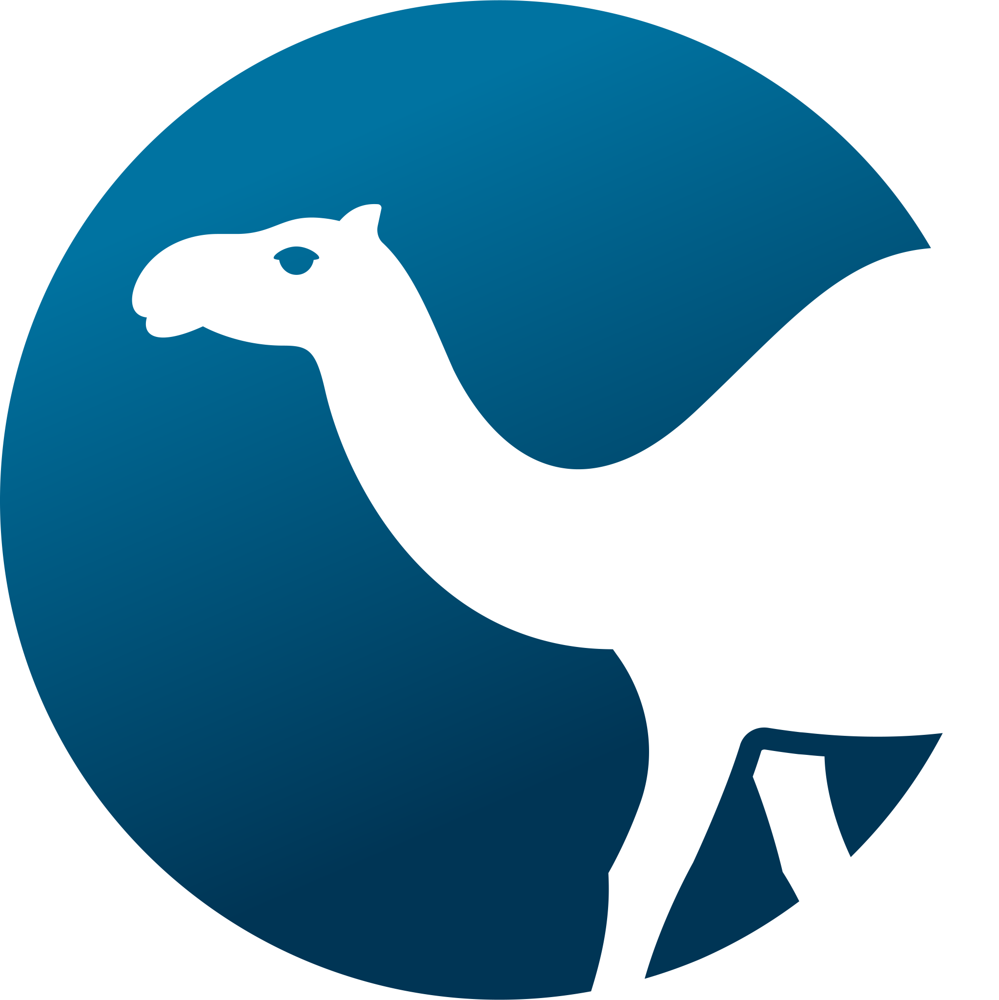
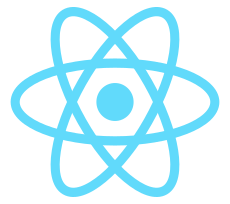
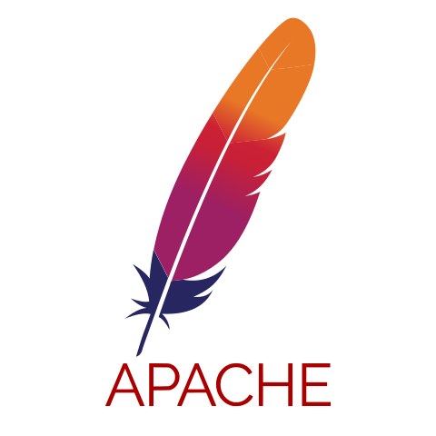
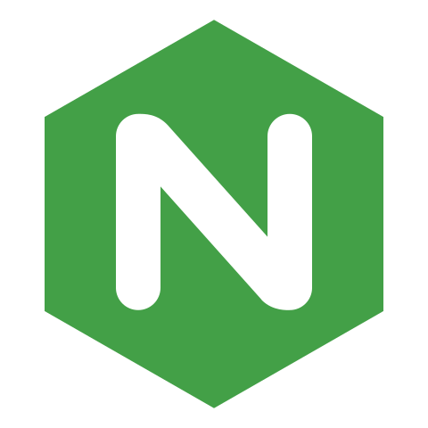
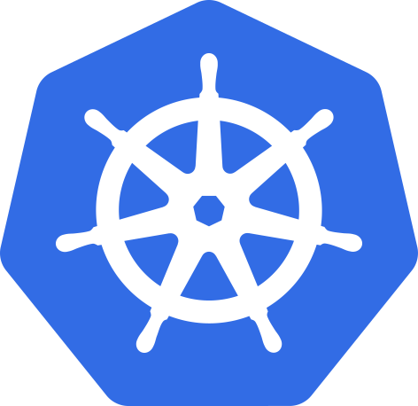
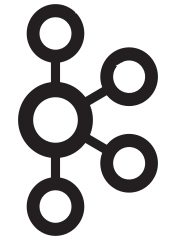
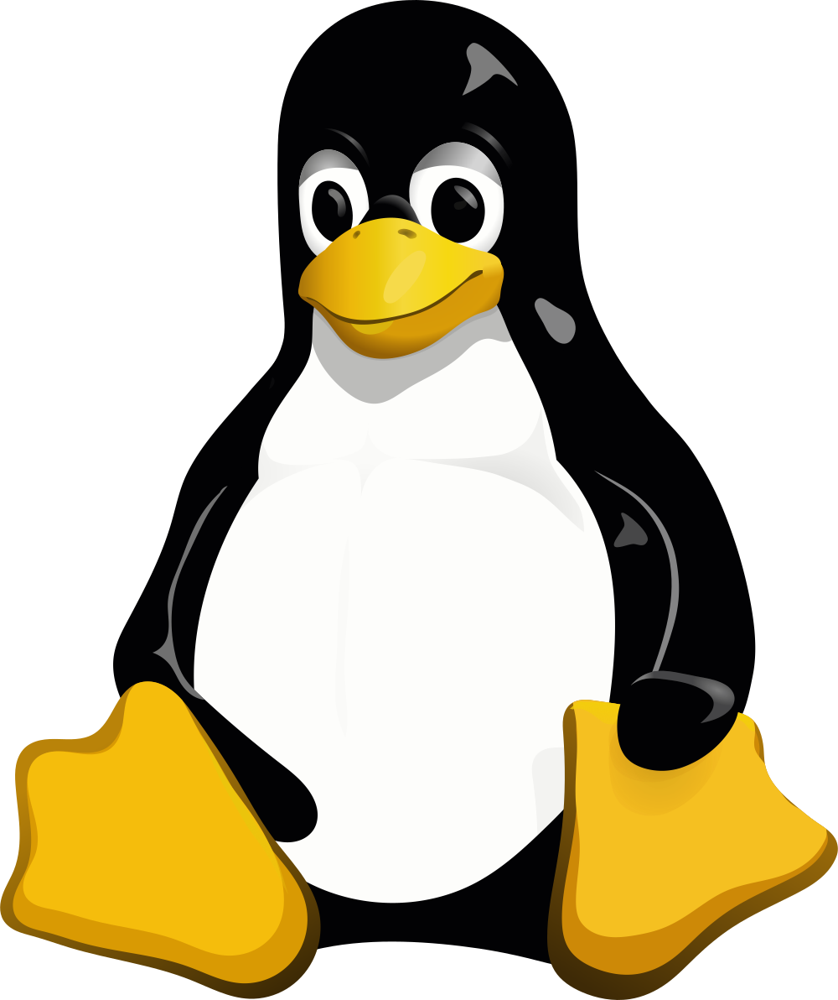
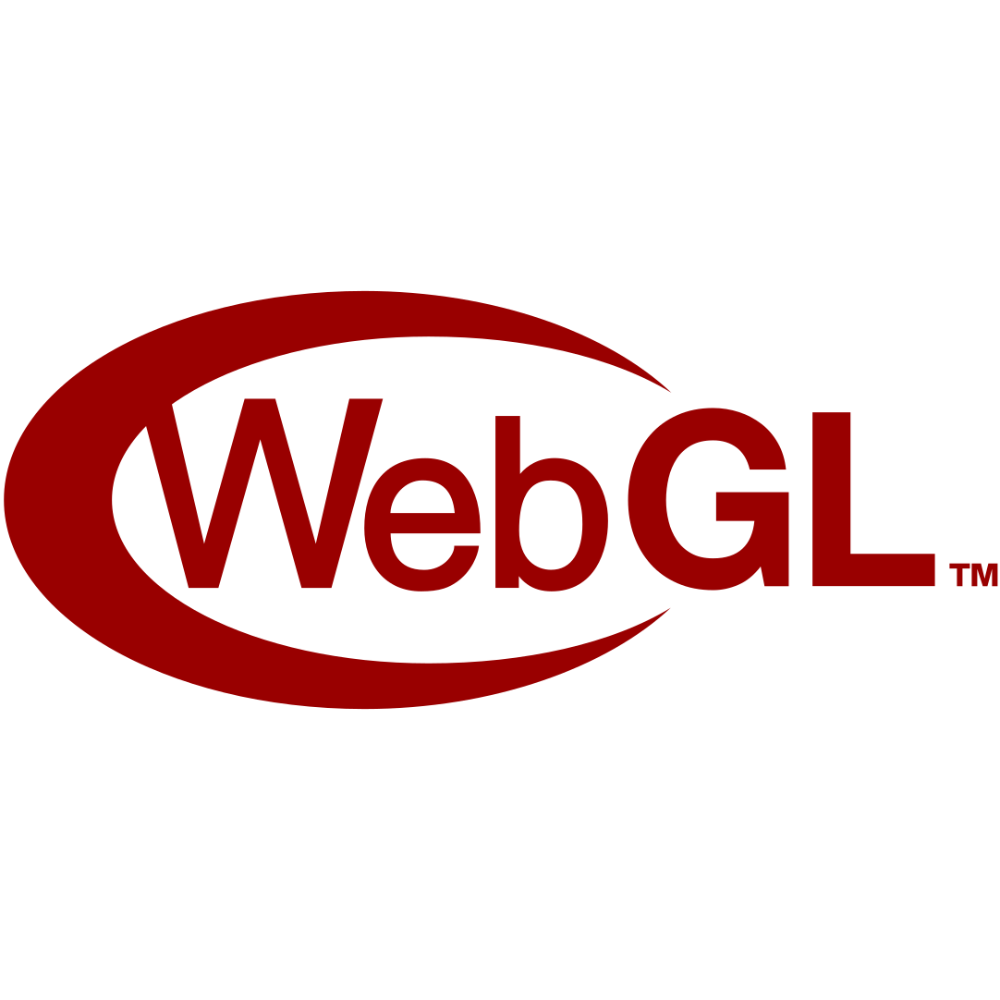

<!--  -->

#  About me

<table>
<tr>
<td>
<fig>

<figcaption>This was one of the first computers I ever used as a kid.</figcaption>
</fig>
</td>
<td style="vertical-align:top;">

* I created [php-wasm](https://php-wasm.com/), which powers frontend php applications like wordpress playground.

* I'm working on a [Sonic Fangame](https://sonic-3000.seanmorr.is/) in my spare time.

* I started my first website in 1998 in elementary school, which started my addiction to the web. (It was for pokemon cheats.)

* I've contributed code to the [Emscripten project](https://emscripten.org/docs/contributing/AUTHORS.html) (because of php-wasm).

* Besides running php on the frontend, I like doing weird stuff like running LUA on SD cards and parsing gameboy games with Javascript.

</td>
<tr>
</table>

## Tools I use

<!--
**seanmorris/seanmorris** is a ✨ _special_ ✨ repository because its `README.md` (this file) appears on your GitHub profile.

Here are some ideas to get you started:

- 🔭 I’m currently working on ...
- 🌱 I’m currently learning ...
- 👯 I’m looking to collaborate on ...
- 🤔 I’m looking for help with ...
- 💬 Ask me about ...
- 📫 How to reach me: ...
- 😄 Pronouns: ...
- ⚡ Fun fact: ...
-->

*Lorem ipsum dolor sit amet*